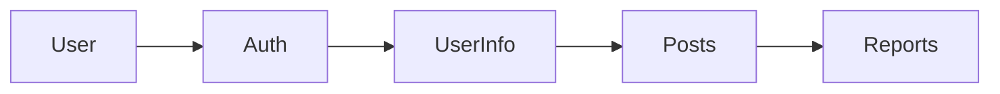

# Ting - 프로젝트를 위한 완벽한 매칭


## 📦 How to Install
**Download in AppStore!**  
[AppStore에서 Ting 다운로드하기](https://apps.apple.com/kr/app/ting-%ED%94%84%EB%A1%9C%EC%A0%9D%ED%8A%B8%EB%A5%BC-%EC[…]C-%EC%99%84%EB%B2%BD%ED%95%9C-%EB%A7%A4%EC%B9%AD/id6741317435)

<br>

## 📱 프로젝트 소개
Ting은 원활한 프로젝트의 시작을 지원하기 위해 탄생했습니다.  
개발자, 디자이너, 기획자 등 여러 직군을 타겟으로 하여,  
기존 프로젝트에 참여하거나, 팀원을 구인할 수 있는 플랫폼입니다.

<br>

## 👥 팀원 소개

| Names     | GitHub   | Parts     |
| -------- | -------- | -----------------------------|
| 이재건   | [@Quaker-Lee](https://github.com/Quaker-Lee) | 메인, 마이페이지, 회원정보입력, 프로젝트 초기 세팅, 앱배포 |
| 유태호   | [@taeryu7](https://github.com/taeryu7) | 게시글 상세화면, 신고하기 |
| 나영진   | [@bryjna07](https://github.com/bryjna07) | 애플로그인 연동, 회원가입, 이용약관 |
| 오푸른솔   | [@solnamul](https://github.com/solnamul) | 게시글 리스트, 게시글 작성, 검색페이지 |

<br>

## 📅 프로젝트 기간
- **MVP**: 2025.01.16 ~ 2025.02.17
- **유저피드백 & 버그수정**: 2025.02.17 ~ 2025.02.19
- **리팩토링**: 2025.02.19 ~ ing

<br>

## 📝 Git Convention
### 커밋 메시지
```
Feat: 새로운 기능 추가
Fix: 버그 수정
Docs: 문서 수정
Style: 코드 포맷팅
Refactor: 코드 리팩토링
Test: 테스트 코드
Chore: 기타 변경사항
Cmt: 주석 수정
```

### PR 규칙
- PR 템플릿 준수
- 최소 3명의 리뷰어 승인 필요
- 기능별 스크린샷 첨부

<br>

## 🛠 개발 환경
- iOS 16.0+
- Swift 6.0+
- MVVM Design Pattern

<br>

## 🔥 Firebase 구조

### Collections
```
firebase/
├── users/
│   └── {uid}
├── infos/
│   └── {infoId}
├── posts/
│   └── {postId}
└── reports/
    └── {reportId}
```

### 데이터 흐름도


<br> 

## ⚡️ 주요 기능 및 구현 내용
### 사용자 인증 및 관리
- **Apple 로그인 (Sign in with Apple)**: `AuthenticationServices` 활용
- **비로그인 둘러보기 모드**: Firebase 인증 없이 콘텐츠 접근 가능
- **이용약관 동의 프로세스**: 필수 약관 동의 후 회원가입 진행
- **회원정보 관리 (수정/탈퇴)**: Firebase Firestore와 `UserDefaults` 활용한 CRUD 작업

### 게시글 관리
- **팀원 모집 / 팀 합류 게시글 작성**: Firestore를 활용한 CRUD
- **카테고리별 게시글 분류**: `(개발자, 디자이너, 기획자, 기타)` 필터링 기능
- **게시글 조회 및 페이징 처리**: `lastDocument` 기반 무한 스크롤 적용
- **게시글 수정 및 삭제**: Firebase에서 게시글 정보 업데이트 및 삭제 처리
- **동적 컴포지셔널 레이아웃**: `UICollectionView`를 활용한 메인 화면 구성
- **태그 기반 필터링**: 다중 선택 가능한 필터 UI 적용

### 검색 및 필터링
- **키워드 기반 게시글 검색**: Firestore에서 검색어 기반 쿼리 실행
- **다중 태그 필터링**: `(게시판 유형, 직무, 작업 방식)` 태그 필터링
- **동적 태그 UI 구현**: `TagFlowLayout`을 활용하여 태그 자동 배치

### 신고 및 차단 시스템
- **부적절한 게시글 신고 기능**: 신고 버튼을 통한 Firestore 신고 데이터 저장
- **신고 내역 관리**: 신고된 게시글 및 사용자 관리
- **누적 신고 시 자동 삭제 처리**: 신고 5회 이상 누적 시 자동 삭제 로직 적용 (`Firestore 트랜잭션` 활용)
- **Slack 알림 연동**: 신고 발생 시 관리자에게 실시간 알림 전송
- **특정 유저 차단 기능**: 차단한 유저의 게시글 자동 숨김 처리

### UI/UX 개선
- **`TagFlowLayout`**: 동적 태그 배치 시스템 구현
- **`LoadingFooterView`**: 페이징 로딩 인디케이터 추가
- **`CustomTag`**: 재사용 가능한 태그 UI 구성
- **반응형 레이아웃**: 다양한 기기 해상도 대응

### 마이페이지 시스템
- **`UserInfoService`**: Firebase Firestore를 활용한 회원 정보 관리 (CRUD)
- **회원정보 수정 및 탈퇴**: `UserDefaults`에 저장된 UID를 기반으로 회원 정보 변경 가능
- **로그인 상태 유지**: `Firebase Auth` 인증을 통한 자동 로그인 기능 지원

<br>

## 🛠 기술 스택
### 프레임워크 및 라이브러리
- **UIKit**: 인터페이스 구현
- **SnapKit**: 코드 기반 AutoLayout
- **Then**: 선언형 UI 구성
- **Firebase Auth**: 사용자 인증
- **Firebase Firestore**: 데이터베이스
- **AuthenticationServices**: Apple 로그인

### 디자인 패턴
- **BaseView**: 공통 UI 컴포넌트 상속 구조
- **CustomTag**: 재사용 가능한 태그 버튼 컴포넌트
- **NotificationCenter**: 화면 간 이벤트 전달
- **Protocol-Delegate**: 모달 및 팝업 데이터 전달

<br>

## 🔨 Trouble Shooting

### 성능 최적화
- 이미지 캐싱 처리로 메모리 사용량 감소
- Firebase 쿼리 최적화로 읽기 횟수 감소
- 무한 스크롤 구현 시 셀 재사용으로 메모리 관리

### 주요 해결 이슈
1. **백그라운드 동기화 문제**
   - 문제: 앱이 백그라운드일 때 데이터 동기화 실패
   - 해결: Background Task Framework 활용

2. **메모리 누수**
   - 문제: 화면 전환 시 메모리 누수 발생
   - 해결: 약한 참조 및 클로저 캡처 리스트 적용
  
-------------------------------
# 업데이트
## v1.0.0
- 출시


## v1.0.1
- 지역 필드 삭제
- 유저 차단기능 구현


## v1.0.2
- 유저피드백 반영
- 다크모드시 일부 배경 색이 변하는 문제 해결
- 프로젝트 파일 내 각종 경고문 삭제
- 각 텍스트필드 글자수 제한 (20, 40, 150)


## v1.0.3
- 유저피드백 반영
- 수정시 태그 선택 테두리 영역 흔적남는 문제 수정
- 기술스택 입력 시 공백데이터 " " 제거 후 데이터 생성되도록 수정
- 게시글 작성페이지 텍스트필드 여백 생성
- 회원정보 입력 키보드 넘기기 적용


## v1.0.4
### 회원정보 추가, 회원정보 입력
- 회원정보 추가, 회원정보 입력에서 텍스트필드 특수문자, 공백을 검증하는 로직이 추가되었습니다.
- 관심사 필드의 글자제한 수가 변경되었습니다.

### 게시글 작성페이지
- 게시글 작성페이지 UI/UX 관련 수정 ( 키보드, 글자 제한, 제약 등 )

### 메인페이지
- 메인 - 최근글 3개 중 하나 신고하면 2개만 나오는 현상 해결
- 메인 - 메인 셀 눌러서 수정,삭제,신고 시 리스트 업데이트 안되는 것 해결

### 차단기능
- 차단 기능 로그인 검증 추가

### 약관동의 로직
- 이용 약관 보고 돌아오면 모두 동의 처리가 안 되는 버그 해결
- 14세 미만 체크 없이도 진행 가능했던 버그 해결
- 동의 처리가 즉시 반영되지 않는 현상 해결
- 약관 동의를 하지 않고 앱 종료시 건너뛰고 회원정보 입력 창으로 넘어가는 버그 해결

### 실시간 업데이트
- 회원정보 수정시 ListVC 자동 업데이트
- 게시글 수정시 main, detail, listVC 자동 업데이트

