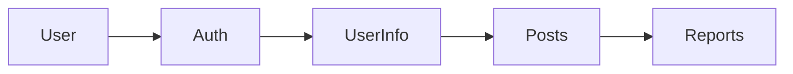

# Ting - 프로젝트를 위한 완벽한 매칭


## 📦 How to Install
<a href="https://apps.apple.com/kr/app/ting-%ED%94%84%EB%A1%9C%EC%A0%9D%ED%8A%B8%EB%A5%BC-%EC%99%84%EB%B2%BD%ED%95%9C-%EB%A7%A4%EC%B9%AD/id6741317435">
    
</a>  

### 클릭 시 앱스토어로 이동합니다.

<br>

## 📱 프로젝트 소개
Ting은 원활한 프로젝트의 시작을 지원하기 위해 탄생했습니다.  
개발자, 디자이너, 기획자 등 여러 직군을 타겟으로 하여,  
기존 프로젝트에 참여하거나, 팀원을 구인할 수 있는 플랫폼입니다.

<br>

## 👥 팀원 소개

| Names     | GitHub   | Parts     |
| -------- | -------- | -----------------------------|
| 이재건   | [@Quaker-Lee](https://github.com/Quaker-Lee) | 메인페이지, 마이페이지, 회원정보입력, 프로젝트 초기 세팅, 앱배포 |
| 유태호   | [@taeryu7](https://github.com/taeryu7) | 게시글 상세화면, 신고하기 |
| 나영진   | [@bryjna07](https://github.com/bryjna07) | 게시글 리스트, 게시글 작성, 검색페이지 |
| 오푸른솔   | [@solnamul](https://github.com/solnamul) | 애플로그인 연동, 회원가입, 이용약관 |

<br>

## 📅 프로젝트 기간
- **MVP**: 2025.01.16 ~ 2025.02.17
- **유저피드백 & 버그수정**: 2025.02.17 ~ 2025.02.19
- **리팩토링**: 2025.02.19 ~ ing

<br>

## 🛠 기술 스택
<p>  
    <!-- Swift -->    
    <!-- UIKit -->    
    <!-- UserDefaults -->    
    <!-- Then -->    
    <!-- SnapKit -->    
    <!-- Firebase -->    
    <!-- Firestore -->    
    <!-- FirebaseAuth -->    <br>
    <!-- AuthenticationServices -->    
    <!-- CryptoKit -->    
    <!-- GitHub -->    
    <!-- Figma -->    
    <!-- Notion -->    
    <!-- Slack -->    
</p>

### 프레임워크 및 라이브러리
- **UIKit**: 인터페이스 구현
- **SnapKit**: 코드 기반 AutoLayout
- **Then**: 선언형 UI 구성
- **Firebase Auth**: 사용자 인증
- **Firebase Firestore**: 데이터베이스
- **AuthenticationServices**: Apple 로그인을 위한 프레임워크
- **CryptoKit**: Apple 로그인 인증에 사용된 해시 라이브러리

### 디자인 패턴
- **BaseView**: 공통 UI 컴포넌트 상속 구조
- **CustomTag**: 재사용 가능한 태그 버튼 컴포넌트
- **NotificationCenter**: 화면 간 이벤트 전달
- **Protocol-Delegate**: 모달 및 팝업 데이터 전달

<br>

## 🛠 개발 환경
- iOS 16.0+
- Swift 6.0+
- MVC Design Pattern

<br>

## 아키텍처


<br>

## 🔥 Firebase 구조

### Collections
```
firebase/
├── users/
│   └── {uid}
├── infos/
│   └── {infoId}
├── posts/
│   └── {postId}
└── reports/
    └── {reportId}
```

### 데이터 흐름도


<br> 

## ⚡️ 주요 기능 및 구현 내용
### 사용자 인증 및 관리
- **Apple 로그인 (Sign in with Apple)**: `AuthenticationServices` 활용
- **비로그인 둘러보기 모드**: Firebase 인증 없이 콘텐츠 접근 가능
- **이용약관 동의 프로세스**: 필수 약관 동의 후 회원가입 진행
- **회원정보 관리 (수정/탈퇴)**: Firebase Firestore와 `UserDefaults` 활용한 CRUD 작업

### 게시글 관리
- **팀원 모집 / 팀 합류 게시글 작성**: Firestore를 활용한 CRUD
- **카테고리별 게시글 분류**: `(개발자, 디자이너, 기획자, 기타)` 필터링 기능
- **게시글 조회 및 페이징 처리**: `lastDocument` 기반 무한 스크롤 적용
- **게시글 수정 및 삭제**: Firebase에서 게시글 정보 업데이트 및 삭제 처리
- **동적 컴포지셔널 레이아웃**: `UICollectionView`를 활용한 메인 화면 구성
- **태그 기반 필터링**: 다중 선택 가능한 필터 UI 적용

### 검색 및 필터링
- **키워드 기반 게시글 검색**: Firestore에서 검색어 기반 쿼리 실행
- **다중 태그 필터링**: `(게시판 유형, 직무, 작업 방식)` 태그 필터링
- **동적 태그 UI 구현**: `TagFlowLayout`을 활용하여 태그 자동 배치

### 신고 및 차단 시스템
- **부적절한 게시글 신고 기능**: 신고 버튼을 통한 Firestore 신고 데이터 저장
- **신고 내역 관리**: 신고된 게시글 및 사용자 관리
- **누적 신고 시 자동 삭제 처리**: 신고 5회 이상 누적 시 자동 삭제 로직 적용 (`Firestore 트랜잭션` 활용)
- **Slack 알림 연동**: 신고 발생 시 관리자에게 실시간 알림 전송
- **특정 유저 차단 기능**: 차단한 유저의 게시글 자동 숨김 처리

### UI/UX 개선
- **`TagFlowLayout`**: 동적 태그 배치 시스템 구현
- **`LoadingFooterView`**: 페이징 로딩 인디케이터 추가
- **`CustomTag`**: 재사용 가능한 태그 UI 구성
- **반응형 레이아웃**: 다양한 기기 해상도 대응

### 마이페이지 시스템
- **`UserInfoService`**: Firebase Firestore를 활용한 회원 정보 관리 (CRUD)
- **회원정보 수정 및 탈퇴**: `UserDefaults`에 저장된 UID를 기반으로 회원 정보 변경 가능
- **로그인 상태 유지**: `Firebase Auth` 인증을 통한 자동 로그인 기능 지원

<br>

## 🔨 Trouble Shooting

<details>
  <summary><strong>🚀 앱스토어 심사 리젝</strong></summary>
  <br>
    
  🔗 **관련PR**   
  [#207](https://github.com/ProjectTing/Ting/pull/207), [#209](https://github.com/ProjectTing/Ting/pull/209), [#210](https://github.com/ProjectTing/Ting/pull/210), [#213](https://github.com/ProjectTing/Ting/pull/213), [#215](https://github.com/ProjectTing/Ting/pull/218)  <br>

  🔍 **원인**  
  - 신고하기, 차단하기 등의 기능이 미흡, 지역이라는 불필요한 개인정보를 요구하여 리젝처리됨  

  ✅ **해결 방안**  
  1. **신고한 게시글 숨김** (Firebase에 저장 후 자동 숨김 처리)  
  2. **누적 신고 시 자동 삭제** (중복 신고 방지 및 일정 횟수 초과 시 삭제)  
  3. **Slack 알림 연동** (신고 발생 시 실시간 알림 전송)  
  4. **차단 유저 숨김** (Firebase에 저장 후 자동 숨김 처리)  
  5. **지역 관련 필드 삭제** (사용자의 지역 입력 필드 제거)  

</details>

<details>
  <summary><strong>🚀 최신 3개의 게시글을 가져온 후 신고 및 차단된 게시글을 필터링하면 3개 미만으로 표시되는 문제</strong></summary>
  <br>

  🔗 **관련PR**  
  [#238](https://github.com/ProjectTing/Ting/pull/238)  <br>

  🔍 **원인**  
  - Firestore에서 `limit(to: 3)`으로 데이터를 가져온 후 필터링을 수행 → 필터링된 후 게시글 수가 부족해짐  

  ✅ **해결 방안**  
  1. Firestore에서 **최신 10개의 게시글**을 가져옴  
  2. 신고 및 차단된 게시글을 필터링  
  3. 필터링 후 최신 **3개 게시글만 반환**  

  🔥 **개선 효과**  
  - 필터링 후에도 **항상 3개 게시글을 유지**하여 사용자 경험 개선  
  - 신고/차단 비율이 높은 경우, 가져오는 데이터 개수를 조정해 성능 최적화 필요  

</details>

<details>
  <summary><strong>🚀 닉네임을 변경하지 않아도, 다른 정보를 수정할 때 닉네임 중복 검사가 강제로 실행되는 문제</strong></summary>
  <br>

  🔗 **관련PR**  
  [#160](https://github.com/ProjectTing/Ting/pull/160)  <br>

  🔍 **원인**  
  - `TextField`의 값이 기존 닉네임과 동일한지 확인하지 않고 중복 검사를 실행하여 발생  

  ✅ **해결 방안**  
  1. 서버에서 가져온 기존 닉네임을 **변수에 저장**  
  2. `TextField`의 값과 기존 닉네임을 비교  
  3. **닉네임이 변경되지 않았다면 중복 검사 생략**, 변경된 경우에만 검사 실행  

  🔥 **개선 효과**  
  - **닉네임을 변경하지 않아도 중복 검사 실행 문제 해결**  
  - 불필요한 중복 검사 방지로 **성능 최적화 및 사용자 경험 개선**  

</details>

<details>
  <summary><strong>🚀 약관 미동의 상태에서도 Firestore에 `termsAccepted: true`로 저장되는 문제</strong></summary>
  <br>

  🔗 **관련PR**  
  [#153](https://github.com/ProjectTing/Ting/pull/153), [#249](https://github.com/ProjectTing/Ting/pull/249)  <br>

  🔍 **원인**  
  1. `SignUpVC`에서 회원가입 시 **약관 동의 여부와 관계없이** `termsAccepted: true`를 Firestore에 저장  
  2. 사용자가 약관을 미동의해도 Firestore에서 동의한 것으로 인식  

  ✅ **해결 방법**  
  ✔ `SignUpVC`에서 `termsAccepted`와 `createdAt` 저장 **제거**  
  ✔ `PermissionVC`에서 **약관 동의 후 Firestore에 업데이트**  

  🔥 **개선 효과**  
  - **약관을 동의하지 않으면 Firestore에 저장되지 않도록 수정**  
  - **재접속 시 약관 동의 단계를 정확히 유지하여 사용자 경험 개선**  

</details>

<br>

## 📝 Git Convention
### 커밋 메시지
```
Feat: 새로운 기능 추가
Fix: 버그 수정
Docs: 문서 수정
Style: 코드 포맷팅
Refactor: 코드 리팩토링
Test: 테스트 코드
Chore: 기타 변경사항
Cmt: 주석 수정
```

### PR 규칙
- PR 템플릿 준수
- 최소 3명의 리뷰어 승인 필요
- 기능별 스크린샷 첨부

<br>
  
-------------------------------
<br>

# 업데이트  
## v1.0.0 ~ 1.0.3  
- 유저피드백 반영  
- 지역 필드 삭제  
- 유저 차단기능 구현  
- 다크모드, 텍스트필드, 키보드 관련 버그 수정  
<br>

## v1.0.4 (현재 버전)  
- [🚀v1.0.4 런칭](https://github.com/ProjectTing/Ting/pull/253)  
<br>

## v1.0.5 (업데이트 예정)  
- SlackService 관련 업데이트  
<br>

## v1.0.6  
### 리팩토링  
- `RXSwift` 적용  
- `MVVM` 패턴으로 구조 변경  
- `HIG`에 따른 UI 수정  
- `Clean Architecture` 반영  
<br>

## v1.0.7  
### 추가기능  
